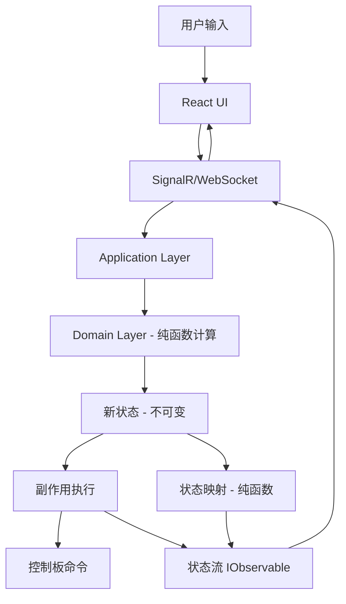

# Design Document: Machine Orchestration System

## Overview

机器编排系统（Machine Orchestration System）是一个工业自动化平台，允许用户通过图形界面组合基础零件构建复杂的自动化机器。系统设计严格遵循 Haskell 函数式编程哲学，使用 .NET 10 和 C# 实现，强调类型安全、纯函数式设计和副作用隔离。

### 核心设计原则

1. **类型安全优先**：使用代数数据类型（Algebraic Data Types）表示所有领域概念，在编译时捕获错误
2. **纯函数核心**：核心业务逻辑实现为纯函数，副作用严格隔离在边界层
3. **递归组合模型**：Part、Component、Module、Machine 统一为可组合实体，支持任意深度递归组合
4. **不可变数据**：所有数据结构默认不可变，状态转换通过函数式变换实现
5. **响应式编程**：使用 System.Reactive (Rx.NET) 处理异步事件流
6. **函数式扩展**：使用 LanguageExt.Core 提供 Option、Either、Try 等函数式类型

### 系统能力

- 零件库管理：提供电机、气缸、夹爪、吸气装置、传感器等基础零件
- 物理组合：通过坐标系统组合零件，支持任意深度的递归组合
- 动作系统：为每种零件定义类型安全的动作状态
- 传感器集成：支持多种传感器类型和连接方式
- DSL 编排：提供领域特定语言定义自动化逻辑
- 控制板抽象：支持多种控制板（雷赛、正运动、模拟）的统一接口
- 运行时可视化：实时显示机器运行状态，支持虚拟和真实设备（React + Three.js 前端）
- 配置管理：保存和加载机器配置，支持多套自动化逻辑

### 技术栈

#### 后端技术栈
- **平台**：.NET 10 (Windows)
- **语言**：C# 13（实现 Haskell 函数式编程哲学）
- **响应式编程**：System.Reactive (Rx.NET) - 核心驱动机制
- **函数式编程**：LanguageExt.Core - 提供函数式扩展（Option/Maybe, Either/Result等）
- **类型系统**：record types、sealed class hierarchy、discriminated unions (C# 13)
- **副作用管理**：Option<T>、Either<L,R>、Try<T>、IO<T> 类型
- **依赖注入**：Microsoft.Extensions.DependencyInjection
- **序列化**：System.Text.Json
- **测试**：xUnit + FsCheck (property-based testing)

#### 前端技术栈
- **框架**：React 19 + TypeScript
- **3D渲染**：Three.js + @react-three/fiber + @react-three/drei
- **动画**：framer-motion + @react-spring/three
- **构建工具**：Vite
- **样式**：Tailwind CSS
- **图标**：lucide-react

### 架构风格

- **函数式核心，命令式外壳**：核心业务逻辑为纯函数，副作用隔离在边界层
- **响应式状态管理**：使用 IObservable<T> 暴露状态流
- **分层架构**：Core（领域核心）→ Devices（设备驱动）→ Interpreters（解释器）→ Visualization（可视化）→ App（应用）
- **DSL-First**：使用 DSL 定义机器结构和自动化流程
- **解释器模式**：DSL 定义产生 AST，解释器将其转换为运行时行为


## Architecture

系统采用分层架构，严格隔离纯函数核心和副作用边界。

### 架构层次

```
┌─────────────────────────────────────────────────────────┐
│                    UI Layer (副作用)                      │
│  - React 前端（Three.js 3D 渲染）                         │
│  - 用户交互处理                                           │
│  - 运行时可视化                                           │
└─────────────────────────────────────────────────────────┘
                          ↓
┌─────────────────────────────────────────────────────────┐
│              Application Layer (副作用边界)               │
│  - 命令处理                                               │
│  - 状态管理（响应式）                                      │
│  - 事件分发（System.Reactive）                            │
└─────────────────────────────────────────────────────────┘
                          ↓
┌─────────────────────────────────────────────────────────┐
│                 Domain Layer (纯函数)                     │
│  - 零件组合逻辑                                           │
│  - 坐标变换计算                                           │
│  - DSL 解析和验证                                         │
│  - 配置验证                                               │
│  - 自动化逻辑解释                                         │
└─────────────────────────────────────────────────────────┘
                          ↓
┌─────────────────────────────────────────────────────────┐
│            Hardware Abstraction Layer (副作用)            │
│  - 控制板接口实现                                         │
│  - 传感器 I/O                                            │
│  - 串口/USB 通信                                         │
└─────────────────────────────────────────────────────────┘
```

### 模块组织

#### 1. Core Domain Module（纯函数）

```
MachineOrchestration.Core/
├── Types/
│   ├── PartTypes.cs           # 零件类型定义
│   ├── ComposableEntity.cs    # 统一组合模型
│   ├── Coordinate.cs          # 坐标系统
│   ├── TransformationMatrix.cs # 变换矩阵
│   ├── Actions.cs             # 动作定义
│   └── Sensors.cs             # 传感器模型
├── Domain/
│   ├── PartLibrary.cs         # 零件库
│   ├── CompositionEngine.cs   # 组合引擎
│   ├── CoordinateSystem.cs    # 坐标系统
│   └── Validation.cs          # 验证逻辑
└── Extensions/
    └── FunctionalExtensions.cs # 函数式扩展方法
```

#### 2. DSL Module（纯函数）

```
MachineOrchestration.Dsl/
├── Ast/
│   ├── Statement.cs          # 语句类型
│   ├── Expression.cs         # 表达式类型
│   └── Condition.cs          # 条件类型
├── Parser/
│   ├── DslParser.cs          # 解析器
│   ├── Lexer.cs              # 词法分析器
│   └── ParseError.cs         # 解析错误
├── PrettyPrinter.cs          # 美化打印器
├── Validator.cs              # 语义验证
└── Interpreter/
    ├── Interpreter.cs        # 解释器（纯函数部分）
    └── ExecutionState.cs     # 执行状态
```

#### 3. Control Board Module（副作用边界）

```
MachineOrchestration.ControlBoards/
├── Abstractions/
│   ├── IControlBoard.cs      # 控制板接口
│   └── Command.cs            # 命令类型
├── Implementations/
│   ├── LeiSaiBoard.cs        # 雷赛实现
│   ├── ZhengYunDongBoard.cs  # 正运动实现
│   └── SimulatedBoard.cs     # 模拟实现
└── Extensions/
    └── ControlBoardExtensions.cs
```

#### 4. Configuration Module（纯函数 + 副作用边界）

```
MachineOrchestration.Configuration/
├── Types/
│   ├── MachineConfig.cs      # 机器配置
│   ├── PartConfig.cs         # 零件配置
│   └── BoardConfig.cs        # 控制板配置
├── Validation/
│   └── ConfigValidator.cs    # 配置验证（纯函数）
├── Serialization/
│   └── ConfigSerializer.cs   # 序列化（纯函数）
└── Persistence/
    └── ConfigPersistence.cs  # 文件 I/O（副作用）
```

#### 5. Automation Module（纯函数 + 副作用边界）

```
MachineOrchestration.Automation/
├── Types/
│   ├── AutomationLogic.cs    # 自动化逻辑类型
│   └── ExecutionState.cs     # 执行状态（不可变）
├── Executor/
│   ├── IAutomationExecutor.cs # 执行器接口
│   └── AutomationExecutor.cs  # 执行器实现（副作用边界）
└── Storage/
    └── LogicStorage.cs       # 逻辑存储（副作用）
```

#### 6. Visualization Module（副作用）

```
MachineOrchestration.Visualization/
├── StateMapping/
│   ├── StateMapper.cs        # 状态映射（纯函数）
│   └── VisualState.cs        # 可视化状态
├── Animation/
│   └── AnimationCalculator.cs # 动画计算（纯函数）
└── Rendering/
    └── IRenderer.cs          # 渲染器接口
```

#### 7. Application Layer

```
MachineOrchestration.App/
├── Services/
│   ├── MachineService.cs     # 机器服务
│   ├── AutomationService.cs  # 自动化服务
│   └── VisualizationService.cs # 可视化服务
├── Api/
│   └── Controllers/          # Web API 控制器
└── SignalR/
    └── Hubs/                 # SignalR 实时通信
```

#### 8. Frontend (React + Three.js)

```
machine-orchestration-front/
├── src/
│   ├── components/
│   │   ├── Scene3D/          # Three.js 3D 场景
│   │   ├── PartLibrary/      # 零件库 UI
│   │   ├── MachineEditor/    # 机器编辑器
│   │   └── AutomationPanel/  # 自动化面板
│   ├── hooks/
│   │   ├── useMachine.ts     # 机器状态钩子
│   │   └── useVisualization.ts # 可视化钩子
│   ├── services/
│   │   └── api.ts            # 后端 API 调用
│   └── types/
│       └── machine.ts        # TypeScript 类型定义
└── package.json
```

### 数据流



### 副作用边界

系统严格隔离纯函数和副作用代码：

**纯函数区域**：
- 零件组合逻辑
- 坐标变换计算
- DSL 解析和验证
- 配置验证
- 状态转换计算
- 动画帧计算

**副作用区域**：
- UI 渲染
- 文件 I/O
- 控制板通信
- 传感器读取
- 日志记录
- 网络通信

**边界管理**：
- 使用 `Either<L, R>` 和 `Option<T>` 表示可能失败的操作
- 副作用函数返回 `Task<Either<Error, T>>` 或 `IO<T>`
- 在模块级别明确标注纯函数和副作用函数
- 使用 LanguageExt.Core 的 Aff<T> 类型管理异步副作用


## Components and Interfaces

### 1. 零件库组件（Part Library Component）

**职责**：管理基础零件定义和分类

**接口**：

```csharp
using LanguageExt;
using static LanguageExt.Prelude;

namespace MachineOrchestration.Core.Domain;

// 纯函数接口
public interface IPartLibrary
{
    Seq<Part> GetAllParts();
    Seq<Part> GetPartsByCategory(PartCategory category);
    Option<Part> GetPartById(PartId id);
}

// 零件分类
public abstract record PartCategory
{
    public sealed record MotorType : PartCategory;      // 电机类型
    public sealed record OutputType : PartCategory;     // 输出类型
    public sealed record InputType : PartCategory;      // 输入类型
    public sealed record StaticType : PartCategory;     // 静态类型
    
    private PartCategory() { }
}
```

**实现要点**：
- 零件库数据为不可变结构
- 查询操作为纯函数
- 使用 Lazy<T> 实现单例

### 2. 组合引擎组件（Composition Engine Component）

**职责**：处理零件的递归组合和坐标变换

**接口**：

```csharp
using LanguageExt;

namespace MachineOrchestration.Core.Domain;

// 纯函数接口
public interface ICompositionEngine
{
    // 组合两个实体
    Either<CompositionError, ComposableEntity> Compose(
        ComposableEntity parent,
        ComposableEntity child,
        Coordinate relativeCoord);
    
    // 应用变换
    ComposableEntity ApplyTransformation(
        ComposableEntity entity,
        TransformationMatrix transform);
    
    // 计算绝对坐标
    Seq<(PartId, Coordinate)> ComputeAbsoluteCoordinates(
        ComposableEntity entity);
}
```

**实现要点**：
- 所有操作为纯函数
- 使用递归算法处理任意深度组合
- 变换矩阵组合满足结合律

### 3. 坐标系统组件（Coordinate System Component）

**职责**：处理三维空间坐标和变换

**接口**：

```csharp
using System.Numerics;

namespace MachineOrchestration.Core.Types;

// 纯函数接口
public static class CoordinateSystem
{
    // 创建坐标
    public static Coordinate CreateCoordinate(
        Vector3 position,
        Quaternion rotation) => 
        new(position, rotation);
    
    // 组合坐标（相对坐标转绝对坐标）
    public static Coordinate ComposeCoordinates(
        Coordinate parent,
        Coordinate childRelative) =>
        new(
            parent.Position + Vector3.Transform(childRelative.Position, parent.Rotation),
            parent.Rotation * childRelative.Rotation);
    
    // 创建变换矩阵
    public static TransformationMatrix CreateTransformation(
        Vector3 translation,
        Quaternion rotation,
        Vector3 scale) =>
        TransformationMatrix.Create(translation, rotation, scale);
    
    // 组合变换矩阵
    public static TransformationMatrix ComposeTransformations(
        TransformationMatrix t1,
        TransformationMatrix t2) =>
        t1.Compose(t2);
    
    // 应用变换到坐标
    public static Coordinate ApplyToCoordinate(
        TransformationMatrix transform,
        Coordinate coord) =>
        transform.ApplyTo(coord);
}
```

**实现要点**：
- 使用 System.Numerics 处理矩阵运算
- 所有操作为纯函数（static 方法）
- 支持四元数表示旋转（避免万向锁）

### 4. DSL 解析器组件（DSL Parser Component）

**职责**：解析和验证 DSL 脚本

**接口**：

```csharp
using LanguageExt;

namespace MachineOrchestration.Dsl.Parser;

// 纯函数接口
public interface IDslParser
{
    // 解析 DSL 脚本
    Either<ParseError, Ast> Parse(string source);
    
    // 验证 AST
    Either<ValidationError, Unit> Validate(Ast ast);
    
    // 美化打印
    string PrettyPrint(Ast ast);
}

// 解析错误包含位置信息
public sealed record ParseError(
    int Line,
    int Column,
    string Message);
```

**实现要点**：
- 使用 Sprache 或 Pidgin 库实现解析器
- 解析器为纯函数
- 错误信息包含行号和列号

### 5. DSL 解释器组件（DSL Interpreter Component）

**职责**：解释执行 DSL 脚本

**接口**：

```csharp
using LanguageExt;
using System.Threading.Tasks;

namespace MachineOrchestration.Dsl.Interpreter;

// 纯函数部分：状态转换
public interface IDslInterpreter
{
    // 执行一步（纯函数）
    Either<ExecutionError, ExecutionState> Step(
        ExecutionState state,
        Ast ast);
    
    // 检查是否完成
    bool IsComplete(ExecutionState state);
}

// 副作用部分：实际执行
public interface IDslExecutor
{
    // 执行命令（副作用）
    Task<Either<ExecutionError, Unit>> ExecuteCommand(Command command);
    
    // 执行状态流
    IObservable<ExecutionState> ExecutionStateStream { get; }
}
```

**实现要点**：
- 状态转换为纯函数
- 副作用隔离在 executor 中
- 使用不可变的 ExecutionState
- 使用 System.Reactive 暴露状态流

### 6. 控制板抽象组件（Control Board Abstraction Component）

**职责**：提供统一的控制板接口

**接口**：

```csharp
using LanguageExt;
using System.Threading.Tasks;

namespace MachineOrchestration.ControlBoards.Abstractions;

// 控制板接口（副作用）
public interface IControlBoard
{
    // 初始化
    Task<Either<ControlBoardError, Unit>> Initialize();
    
    // 发送电机命令
    Task<Either<ControlBoardError, Unit>> SendMotorCommand(
        MotorId motorId,
        MotorAction command);
    
    // 发送执行器命令
    Task<Either<ControlBoardError, Unit>> SendActuatorCommand(
        ActuatorId actuatorId,
        ActuatorAction command);
    
    // 读取传感器
    Task<Either<ControlBoardError, SensorReading>> ReadSensor(
        SensorId sensorId);
    
    // 读取状态传感器
    Task<Either<ControlBoardError, bool>> ReadStateSensor(
        StateSensorId sensorId);
    
    // 停止所有动作
    Task<Either<ControlBoardError, Unit>> EmergencyStop();
    
    // 状态流
    IObservable<ControlBoardState> StateStream { get; }
}
```

**实现要点**：
- 使用 async/await 支持异步 I/O
- 所有方法返回 Either<Error, T> 表示可能失败
- 提供模拟实现用于测试
- 使用 System.Reactive 暴露状态流

### 7. 传感器管理组件（Sensor Management Component）

**职责**：管理传感器配置和读取

**接口**：

```csharp
using LanguageExt;
using System.Threading.Tasks;

namespace MachineOrchestration.Core.Domain;

// 传感器配置（纯函数）
public interface ISensorConfig
{
    Either<ValidationError, Unit> ValidateConfig(
        SensorConfiguration config);
}

// 传感器读取（副作用）
public interface ISensorReader
{
    Task<Either<SensorError, SensorReading>> Read(Sensor sensor);
    
    // 传感器读数流
    IObservable<SensorReading> ReadingStream(SensorId sensorId);
}
```

**实现要点**：
- 配置验证为纯函数
- I/O 操作隔离在 reader 中
- 支持串口和 USB 连接
- 使用 System.Reactive 暴露读数流

### 8. 配置管理组件（Configuration Management Component）

**职责**：处理配置的序列化和验证

**接口**：

```csharp
using LanguageExt;
using System.Threading.Tasks;

namespace MachineOrchestration.Configuration;

// 纯函数接口
public interface IConfigSerializer
{
    Either<SerializationError, string> Serialize(MachineConfig config);
    Either<DeserializationError, MachineConfig> Deserialize(string data);
}

public interface IConfigValidator
{
    Either<ValidationError, Unit> Validate(MachineConfig config);
}

// 副作用接口
public interface IConfigPersistence
{
    Task<Either<IoError, Unit>> Save(MachineConfig config, string path);
    Task<Either<IoError, MachineConfig>> Load(string path);
}
```

**实现要点**：
- 序列化/反序列化为纯函数
- 使用 System.Text.Json
- 文件 I/O 隔离在 persistence 中

### 9. 可视化组件（Visualization Component）

**职责**：渲染机器状态和动画（通过 React 前端）

**接口**：

```csharp
using LanguageExt;
using System.Reactive;

namespace MachineOrchestration.Visualization;

// 状态映射（纯函数）
public interface IStateMapper
{
    VisualState MapToVisualState(MachineState machineState);
    
    VisualState ComputeAnimationFrame(
        VisualState from,
        VisualState to,
        float progress);
}

// 状态流（响应式）
public interface IVisualizationService
{
    IObservable<VisualState> VisualStateStream { get; }
    
    // 设置更新频率（至少 10 FPS）
    void SetUpdateRate(int framesPerSecond);
}
```

**实现要点**：
- 状态映射和动画计算为纯函数
- 使用 System.Reactive 暴露状态流
- 前端通过 SignalR 订阅状态更新
- 支持至少 10 FPS 更新率

### 10. 自动化逻辑管理组件（Automation Logic Management Component）

**职责**：管理多套自动化逻辑

**接口**：

```csharp
using LanguageExt;
using System.Threading.Tasks;

namespace MachineOrchestration.Automation;

// 纯函数接口
public interface IAutomationLogicManager
{
    Either<LogicError, IAutomationLogicManager> AddLogic(
        LogicId id,
        AutomationLogic logic);
    
    Option<AutomationLogic> GetLogic(LogicId id);
    
    Seq<LogicId> ListLogics();
}

// 副作用接口
public interface IAutomationExecutor
{
    Task<Either<ExecutionError, Unit>> Execute(
        AutomationLogic logic,
        Machine machine);
    
    Task<Either<ExecutionError, Unit>> Stop();
    
    IObservable<ExecutionState> ExecutionStateStream { get; }
}
```

**实现要点**：
- 逻辑管理为纯函数（使用不可变数据结构）
- 执行器包含副作用
- 使用 System.Reactive 暴露执行状态流
- 支持优雅停止


## Data Models

系统使用代数数据类型表示所有领域概念，确保类型安全和编译时验证。使用 C# record types 和 sealed class hierarchy 实现代数数据类型。

### 1. 零件分类（Part Category）

```csharp
using LanguageExt;

namespace MachineOrchestration.Core.Types;

/// <summary>
/// 零件分类系统（和类型 - Sum Type）
/// </summary>
public abstract record PartCategory
{
    /// <summary>电机类型（丝杆滑块、旋转座等）</summary>
    public sealed record MotorType : PartCategory
    {
        private MotorType() { }
        public static readonly MotorType Instance = new();
    }
    
    /// <summary>输出类型（指示灯、气缸、夹爪、吸气装置）</summary>
    public sealed record OutputType : PartCategory
    {
        private OutputType() { }
        public static readonly OutputType Instance = new();
    }
    
    /// <summary>输入类型（传感器）</summary>
    public sealed record InputType : PartCategory
    {
        private InputType() { }
        public static readonly InputType Instance = new();
    }
    
    /// <summary>静态类型（轴等结构件）</summary>
    public sealed record StaticType : PartCategory
    {
        private StaticType() { }
        public static readonly StaticType Instance = new();
    }
    
    private PartCategory() { }
}
```

### 2. 零件定义（Part Definition）

```csharp
using System;
using System.Numerics;
using LanguageExt;

namespace MachineOrchestration.Core.Types;

/// <summary>零件 ID（newtype 模式）</summary>
public readonly record struct PartId(Guid Value);

/// <summary>零件类型（和类型）</summary>
public abstract record PartType
{
    public sealed record Motor(MotorType Type) : PartType;
    public sealed record Actuator(ActuatorType Type) : PartType;
    public sealed record Sensor(SensorType Type) : PartType;
    public sealed record Static(StaticType Type) : PartType;
    
    private PartType() { }
}

/// <summary>电机类型</summary>
public abstract record MotorType
{
    /// <summary>丝杆滑块（滑块运动表达电机动作）</summary>
    public sealed record LinearScrew(
        float MaxSpeed,
        float StrokeLength) : MotorType;
    
    /// <summary>旋转座</summary>
    public sealed record RotaryTable(
        float MaxSpeed,
        float MaxAngle) : MotorType;
    
    private MotorType() { }
}

/// <summary>执行器类型（气缸、夹爪、吸气装置的统一抽象）</summary>
public abstract record ActuatorType
{
    /// <summary>气缸</summary>
    public sealed record Cylinder(
        float StrokeLength,
        CylinderSensorConfig SensorConfig) : ActuatorType;
    
    /// <summary>夹爪</summary>
    public sealed record Gripper(
        float MaxOpening,
        Option<GripperSensorConfig> SensorConfig) : ActuatorType;
    
    /// <summary>吸气装置</summary>
    public sealed record Suction(
        Option<SuctionSensorConfig> SensorConfig) : ActuatorType;
    
    /// <summary>指示灯</summary>
    public sealed record Indicator : ActuatorType
    {
        private Indicator() { }
        public static readonly Indicator Instance = new();
    }
    
    private ActuatorType() { }
}

/// <summary>气缸传感器配置（和类型）</summary>
public abstract record CylinderSensorConfig
{
    /// <summary>无传感器</summary>
    public sealed record None : CylinderSensorConfig
    {
        private None() { }
        public static readonly None Instance = new();
    }
    
    /// <summary>仅伸出传感器</summary>
    public sealed record ExtendOnly(SensorPort ExtendSensorPort) : CylinderSensorConfig;
    
    /// <summary>伸出和缩回传感器</summary>
    public sealed record Both(
        SensorPort ExtendSensorPort,
        SensorPort RetractSensorPort) : CylinderSensorConfig;
    
    private CylinderSensorConfig() { }
}

/// <summary>夹爪传感器配置</summary>
public sealed record GripperSensorConfig(
    Option<SensorPort> ClosedSensorPort,
    Option<SensorPort> OpenedSensorPort);

/// <summary>吸气装置传感器配置</summary>
public sealed record SuctionSensorConfig(SensorPort VacuumSensorPort);

/// <summary>传感器类型</summary>
public abstract record SensorType
{
    public sealed record Pressure(float Range, PressureUnit Unit) : SensorType;
    public sealed record Micrometer(float Resolution) : SensorType;
    public sealed record Scanner(ScannerProtocol Protocol) : SensorType;
    
    private SensorType() { }
}

/// <summary>压力单位</summary>
public enum PressureUnit { Pa, KPa, MPa, Bar, Psi }

/// <summary>扫码器协议</summary>
public enum ScannerProtocol { Serial, Usb, Ethernet }

/// <summary>静态零件类型</summary>
public abstract record StaticType
{
    public sealed record Shaft(float Length, float Diameter) : StaticType;
    public sealed record Bracket(Vector3 Dimensions) : StaticType;
    
    private StaticType() { }
}

/// <summary>传感器端口</summary>
public readonly record struct SensorPort(ushort PortNumber);

/// <summary>零件定义</summary>
public sealed record Part(
    PartId Id,
    string Name,
    PartType PartType,
    PartCategory Category,
    Vector3 PhysicalDimensions);
```

### 3. 坐标和变换（Coordinate and Transformation）

```csharp
using System.Numerics;

namespace MachineOrchestration.Core.Types;

/// <summary>坐标（位置 + 姿态）</summary>
public readonly record struct Coordinate(
    Vector3 Position,
    Quaternion Rotation)
{
    public static readonly Coordinate Identity = new(Vector3.Zero, Quaternion.Identity);
}

/// <summary>变换矩阵（4x4 齐次变换矩阵）</summary>
public readonly record struct TransformationMatrix
{
    private readonly Matrix4x4 _matrix;
    
    private TransformationMatrix(Matrix4x4 matrix) => _matrix = matrix;
    
    public static readonly TransformationMatrix Identity = 
        new(Matrix4x4.Identity);
    
    /// <summary>创建平移变换</summary>
    public static TransformationMatrix Translation(Vector3 v) =>
        new(Matrix4x4.CreateTranslation(v));
    
    /// <summary>创建旋转变换</summary>
    public static TransformationMatrix Rotation(Quaternion q) =>
        new(Matrix4x4.CreateFromQuaternion(q));
    
    /// <summary>创建缩放变换</summary>
    public static TransformationMatrix Scale(Vector3 s) =>
        new(Matrix4x4.CreateScale(s));
    
    /// <summary>创建完整变换</summary>
    public static TransformationMatrix Create(
        Vector3 translation,
        Quaternion rotation,
        Vector3 scale) =>
        new(Matrix4x4.CreateScale(scale) *
            Matrix4x4.CreateFromQuaternion(rotation) *
            Matrix4x4.CreateTranslation(translation));
    
    /// <summary>组合变换（满足结合律）</summary>
    public TransformationMatrix Compose(TransformationMatrix other) =>
        new(_matrix * other._matrix);
    
    /// <summary>应用到坐标</summary>
    public Coordinate ApplyTo(Coordinate coord)
    {
        var transformedPos = Vector3.Transform(coord.Position, _matrix);
        var transformedRot = coord.Rotation * Quaternion.CreateFromRotationMatrix(
            Matrix4x4.CreateFromQuaternion(Quaternion.Identity) * _matrix);
        return new Coordinate(transformedPos, transformedRot);
    }
}
```

### 4. 统一组合模型（Composable Entity）

```csharp
using System;
using LanguageExt;
using static LanguageExt.Prelude;

namespace MachineOrchestration.Core.Types;

/// <summary>可组合实体 ID</summary>
public readonly record struct EntityId(Guid Value);

/// <summary>可组合实体（递归代数数据类型）</summary>
public abstract record ComposableEntity
{
    /// <summary>基础零件</summary>
    public sealed record Part(
        EntityId Id,
        Types.Part PartData,
        Coordinate Coordinate,
        PartConfig Config) : ComposableEntity;
    
    /// <summary>组合实体（递归）</summary>
    public sealed record Composite(
        EntityId Id,
        string Name,
        Seq<(ComposableEntity Entity, Coordinate RelativeCoord)> Children,
        Coordinate Coordinate) : ComposableEntity;
    
    private ComposableEntity() { }
    
    /// <summary>获取实体 ID</summary>
    public EntityId GetId() => this switch
    {
        Part p => p.Id,
        Composite c => c.Id,
        _ => throw new InvalidOperationException()
    };
    
    /// <summary>获取坐标</summary>
    public Coordinate GetCoordinate() => this switch
    {
        Part p => p.Coordinate,
        Composite c => c.Coordinate,
        _ => throw new InvalidOperationException()
    };
    
    /// <summary>应用变换（递归）</summary>
    public ComposableEntity ApplyTransformation(TransformationMatrix transform) =>
        this switch
        {
            Part p => p with { Coordinate = transform.ApplyTo(p.Coordinate) },
            Composite c => c with
            {
                Coordinate = transform.ApplyTo(c.Coordinate),
                Children = c.Children.Map(child =>
                    (child.Entity.ApplyTransformation(transform), child.RelativeCoord))
            },
            _ => throw new InvalidOperationException()
        };
    
    /// <summary>计算所有零件的绝对坐标</summary>
    public Seq<(PartId, Coordinate)> ComputeAbsoluteCoordinates() =>
        ComputeAbsoluteCoordinatesHelper(Coordinate.Identity);
    
    private Seq<(PartId, Coordinate)> ComputeAbsoluteCoordinatesHelper(
        Coordinate parentAbsolute) =>
        this switch
        {
            Part p => Seq1((p.PartData.Id, 
                CoordinateSystem.ComposeCoordinates(parentAbsolute, p.Coordinate))),
            Composite c => c.Children.Bind(child =>
            {
                var childAbsolute = CoordinateSystem.ComposeCoordinates(
                    parentAbsolute, child.RelativeCoord);
                return child.Entity.ComputeAbsoluteCoordinatesHelper(childAbsolute);
            }),
            _ => Seq<(PartId, Coordinate)>()
        };
    
    /// <summary>添加子实体</summary>
    public Either<CompositionError, ComposableEntity> AddChild(
        ComposableEntity child,
        Coordinate relativeCoord) =>
        this switch
        {
            Composite c => Right<CompositionError, ComposableEntity>(
                c with
                {
                    Children = c.Children.Add((child, relativeCoord))
                }),
            _ => Left<CompositionError, ComposableEntity>(
                new CompositionError.CannotAddChildToLeaf())
        };
}

/// <summary>类型别名（语义清晰）</summary>
public static class ComposableEntityAliases
{
    public static ComposableEntity.Composite CreateComponent(
        EntityId id,
        string name,
        Seq<(ComposableEntity, Coordinate)> children,
        Coordinate coordinate) =>
        new(id, name, children, coordinate);
    
    public static ComposableEntity.Composite CreateModule(
        EntityId id,
        string name,
        Seq<(ComposableEntity, Coordinate)> children,
        Coordinate coordinate) =>
        new(id, name, children, coordinate);
    
    public static ComposableEntity.Composite CreateMachine(
        EntityId id,
        string name,
        Seq<(ComposableEntity, Coordinate)> children,
        Coordinate coordinate) =>
        new(id, name, children, coordinate);
}
```

### 5. 动作定义（Action Definition）

```csharp
namespace MachineOrchestration.Core.Types;

/// <summary>电机动作</summary>
public abstract record MotorAction
{
    /// <summary>移动到位置</summary>
    public sealed record MoveTo(float Position, float Speed) : MotorAction;
    
    /// <summary>旋转到角度</summary>
    public sealed record RotateTo(float Angle, float Speed) : MotorAction;
    
    /// <summary>回零</summary>
    public sealed record Home : MotorAction
    {
        private Home() { }
        public static readonly Home Instance = new();
    }
    
    /// <summary>停止</summary>
    public sealed record Stop : MotorAction
    {
        private Stop() { }
        public static readonly Stop Instance = new();
    }
    
    private MotorAction() { }
}

/// <summary>执行器动作</summary>
public abstract record ActuatorAction
{
    /// <summary>气缸伸出</summary>
    public sealed record Extend : ActuatorAction
    {
        private Extend() { }
        public static readonly Extend Instance = new();
    }
    
    /// <summary>气缸缩回</summary>
    public sealed record Retract : ActuatorAction
    {
        private Retract() { }
        public static readonly Retract Instance = new();
    }
    
    /// <summary>夹爪闭合</summary>
    public sealed record Close : ActuatorAction
    {
        private Close() { }
        public static readonly Close Instance = new();
    }
    
    /// <summary>夹爪松开</summary>
    public sealed record Open : ActuatorAction
    {
        private Open() { }
        public static readonly Open Instance = new();
    }
    
    /// <summary>吸气装置吸气</summary>
    public sealed record Suction : ActuatorAction
    {
        private Suction() { }
        public static readonly Suction Instance = new();
    }
    
    /// <summary>吸气装置常规</summary>
    public sealed record Normal : ActuatorAction
    {
        private Normal() { }
        public static readonly Normal Instance = new();
    }
    
    /// <summary>指示灯开</summary>
    public sealed record On : ActuatorAction
    {
        private On() { }
        public static readonly On Instance = new();
    }
    
    /// <summary>指示灯关</summary>
    public sealed record Off : ActuatorAction
    {
        private Off() { }
        public static readonly Off Instance = new();
    }
    
    private ActuatorAction() { }
}

/// <summary>零件动作（和类型）</summary>
public abstract record PartAction
{
    public sealed record Motor(MotorAction Action) : PartAction;
    public sealed record Actuator(ActuatorAction Action) : PartAction;
    
    private PartAction() { }
}
```

### 6. 零件配置（Part Configuration）

```csharp
using LanguageExt;

namespace MachineOrchestration.Core.Types;

/// <summary>电机配置</summary>
public sealed record MotorConfig(
    float WorkingSpeed,
    HomingMode HomingMode,
    BoardConnection BoardConnection,
    LimitSensors LimitSensors);

/// <summary>回零模式</summary>
public enum HomingMode
{
    PositiveLimit,
    NegativeLimit,
    HomeSwitch
}

/// <summary>控制板连接</summary>
public sealed record BoardConnection(byte AxisNumber);

/// <summary>限位传感器</summary>
public sealed record LimitSensors(
    Option<SensorPort> PositiveLimit,
    Option<SensorPort> NegativeLimit);

/// <summary>执行器配置</summary>
public sealed record ActuatorConfig(
    ushort OutputPort,
    Option<StateSensorPorts> StateSensorPorts);

/// <summary>状态传感器端口配置</summary>
public abstract record StateSensorPorts
{
    public sealed record Cylinder(CylinderSensorConfig Config) : StateSensorPorts;
    public sealed record Gripper(GripperSensorConfig Config) : StateSensorPorts;
    public sealed record Suction(SuctionSensorConfig Config) : StateSensorPorts;
    
    private StateSensorPorts() { }
}

/// <summary>传感器配置</summary>
public sealed record SensorConfig(SensorConnection Connection);

/// <summary>传感器连接方式</summary>
public abstract record SensorConnection
{
    /// <summary>串口单传感器</summary>
    public sealed record SerialSingle(string Port, uint BaudRate) : SensorConnection;
    
    /// <summary>串口多传感器</summary>
    public sealed record SerialMultiple(string Port, uint BaudRate, byte Address) : SensorConnection;
    
    /// <summary>USB 连接</summary>
    public sealed record Usb(ushort VendorId, ushort ProductId) : SensorConnection;
    
    private SensorConnection() { }
}

/// <summary>零件配置（和类型）</summary>
public abstract record PartConfig
{
    public sealed record Motor(MotorConfig Config) : PartConfig;
    public sealed record Actuator(ActuatorConfig Config) : PartConfig;
    public sealed record Sensor(SensorConfig Config) : PartConfig;
    public sealed record Static : PartConfig
    {
        private Static() { }
        public static readonly Static Instance = new();
    }
    
    private PartConfig() { }
}
```


### 7. DSL 抽象语法树（DSL AST）

```csharp
using System;
using System.Collections.Generic;
using LanguageExt;

namespace MachineOrchestration.Dsl.Ast;

/// <summary>DSL 抽象语法树</summary>
public sealed record Ast(Seq<Statement> Statements);

/// <summary>语句</summary>
public abstract record Statement
{
    /// <summary>动作执行</summary>
    public sealed record Action(
        EntityId EntityId,
        PartAction Action) : Statement;
    
    /// <summary>等待</summary>
    public sealed record Wait(TimeSpan Duration) : Statement;
    
    /// <summary>等待条件</summary>
    public sealed record WaitUntil(Condition Condition) : Statement;
    
    /// <summary>顺序执行</summary>
    public sealed record Sequence(Seq<Statement> Statements) : Statement;
    
    /// <summary>并行执行</summary>
    public sealed record Parallel(Seq<Statement> Statements) : Statement;
    
    /// <summary>循环</summary>
    public sealed record Loop(
        Option<uint> Count,
        Statement Body) : Statement;
    
    /// <summary>条件分支</summary>
    public sealed record If(
        Condition Condition,
        Statement ThenBranch,
        Option<Statement> ElseBranch) : Statement;
    
    private Statement() { }
}

/// <summary>条件表达式</summary>
public abstract record Condition
{
    /// <summary>传感器状态</summary>
    public sealed record SensorState(
        EntityId SensorId,
        bool Expected) : Condition;
    
    /// <summary>状态传感器</summary>
    public sealed record StateSensor(
        StateSensorId SensorId,
        bool Expected) : Condition;
    
    /// <summary>传感器值比较</summary>
    public sealed record SensorValue(
        EntityId SensorId,
        ComparisonOp Operator,
        float Value) : Condition;
    
    /// <summary>逻辑与</summary>
    public sealed record And(Condition Left, Condition Right) : Condition;
    
    /// <summary>逻辑或</summary>
    public sealed record Or(Condition Left, Condition Right) : Condition;
    
    /// <summary>逻辑非</summary>
    public sealed record Not(Condition Inner) : Condition;
    
    private Condition() { }
}

/// <summary>比较运算符</summary>
public enum ComparisonOp
{
    Equal,
    NotEqual,
    Greater,
    GreaterOrEqual,
    Less,
    LessOrEqual
}

/// <summary>状态传感器 ID</summary>
public readonly record struct StateSensorId(Guid Value);
```

### 8. 控制板命令（Control Board Command）

```csharp
using System;

namespace MachineOrchestration.ControlBoards.Abstractions;

/// <summary>控制板命令</summary>
public abstract record Command
{
    public sealed record Motor(
        MotorId MotorId,
        MotorAction Action) : Command;
    
    public sealed record Actuator(
        ActuatorId ActuatorId,
        ActuatorAction Action) : Command;
    
    public sealed record ReadSensor(SensorId SensorId) : Command;
    
    public sealed record ReadStateSensor(StateSensorId SensorId) : Command;
    
    public sealed record EmergencyStop : Command
    {
        private EmergencyStop() { }
        public static readonly EmergencyStop Instance = new();
    }
    
    private Command() { }
}

/// <summary>电机 ID</summary>
public readonly record struct MotorId(Guid Value);

/// <summary>执行器 ID</summary>
public readonly record struct ActuatorId(Guid Value);

/// <summary>传感器 ID</summary>
public readonly record struct SensorId(Guid Value);
```

### 9. 执行状态（Execution State）

```csharp
using System.Collections.Generic;
using LanguageExt;

namespace MachineOrchestration.Dsl.Interpreter;

/// <summary>执行状态（不可变）</summary>
public sealed record ExecutionState(
    int ProgramCounter,
    MachineState MachineState,
    Seq<StackFrame> CallStack,
    HashMap<string, Value> Bindings);

/// <summary>机器状态</summary>
public sealed record MachineState(
    HashMap<PartId, PartState> PartStates);

/// <summary>零件状态</summary>
public abstract record PartState
{
    public sealed record Motor(
        float CurrentPosition,
        bool IsMoving) : PartState;
    
    public sealed record Actuator(
        ActuatorAction CurrentAction) : PartState;
    
    public sealed record Sensor(
        Option<SensorReading> LastReading) : PartState;
    
    private PartState() { }
}

/// <summary>传感器读数</summary>
public abstract record SensorReading
{
    public sealed record Pressure(float Value) : SensorReading;
    public sealed record Distance(float Value) : SensorReading;
    public sealed record Barcode(string Value) : SensorReading;
    public sealed record Boolean(bool Value) : SensorReading;
    
    private SensorReading() { }
}

/// <summary>栈帧</summary>
public sealed record StackFrame(
    int ReturnAddress,
    HashMap<string, Value> LocalBindings);

/// <summary>值</summary>
public abstract record Value
{
    public sealed record Number(float Value) : Value;
    public sealed record Boolean(bool Value) : Value;
    public sealed record String(string Value) : Value;
    
    private Value() { }
}
```

### 10. 配置和持久化（Configuration and Persistence）

```csharp
using System;
using System.Text.Json.Serialization;
using LanguageExt;

namespace MachineOrchestration.Configuration;

/// <summary>机器配置</summary>
public sealed record MachineConfig(
    ComposableEntity Machine,
    ControlBoardConfig ControlBoard,
    HashMap<LogicId, AutomationLogic> AutomationLogics);

/// <summary>控制板配置</summary>
[JsonDerivedType(typeof(LeiSai), "leisai")]
[JsonDerivedType(typeof(ZhengYunDong), "zhengyundong")]
[JsonDerivedType(typeof(Simulated), "simulated")]
public abstract record ControlBoardConfig
{
    public sealed record LeiSai(
        string Connection,
        LeiSaiParameters Parameters) : ControlBoardConfig;
    
    public sealed record ZhengYunDong(
        string Connection,
        ZhengYunDongParameters Parameters) : ControlBoardConfig;
    
    public sealed record Simulated(
        long LatencyMs) : ControlBoardConfig;
    
    private ControlBoardConfig() { }
}

/// <summary>雷赛参数</summary>
public sealed record LeiSaiParameters(
    int MaxAxes,
    float DefaultSpeed);

/// <summary>正运动参数</summary>
public sealed record ZhengYunDongParameters(
    int MaxAxes,
    float DefaultSpeed);

/// <summary>自动化逻辑</summary>
public sealed record AutomationLogic(
    LogicId Id,
    string Name,
    Ast Ast);

/// <summary>逻辑 ID</summary>
public readonly record struct LogicId(Guid Value);
```

### 11. 错误类型（Error Types）

```csharp
using System;
using System.Collections.Generic;

namespace MachineOrchestration.Core.Types;

/// <summary>组合错误</summary>
public abstract record CompositionError
{
    public sealed record InvalidCoordinate(string Message) : CompositionError;
    public sealed record CircularReference : CompositionError
    {
        private CircularReference() { }
        public static readonly CircularReference Instance = new();
    }
    public sealed record MaxDepthExceeded(int Depth) : CompositionError;
    public sealed record CannotAddChildToLeaf : CompositionError
    {
        private CannotAddChildToLeaf() { }
        public static readonly CannotAddChildToLeaf Instance = new();
    }
    
    private CompositionError() { }
}

/// <summary>解析错误</summary>
public sealed record ParseError(
    int Line,
    int Column,
    string Message);

/// <summary>验证错误</summary>
public abstract record ValidationError
{
    public sealed record MissingField(string FieldName) : ValidationError;
    public sealed record InvalidValue(string Field, string Reason) : ValidationError;
    public sealed record MissingSensorPort : ValidationError
    {
        private MissingSensorPort() { }
        public static readonly MissingSensorPort Instance = new();
    }
    public sealed record IncompatibleConfig(string Message) : ValidationError;
    public sealed record Multiple(Seq<ValidationError> Errors) : ValidationError;
    
    private ValidationError() { }
}

/// <summary>执行错误</summary>
public abstract record ExecutionError
{
    public sealed record HardwareError(string Message) : ExecutionError;
    public sealed record Timeout : ExecutionError
    {
        private Timeout() { }
        public static readonly Timeout Instance = new();
    }
    public sealed record InvalidStateTransition(string Message) : ExecutionError;
    public sealed record SensorError(string Message) : ExecutionError;
    
    private ExecutionError() { }
}

/// <summary>控制板错误</summary>
public abstract record ControlBoardError
{
    public sealed record ConnectionError(string Message) : ControlBoardError;
    public sealed record CommandFailed(string Message) : ControlBoardError;
    public sealed record NotInitialized : ControlBoardError
    {
        private NotInitialized() { }
        public static readonly NotInitialized Instance = new();
    }
    
    private ControlBoardError() { }
}

/// <summary>序列化错误</summary>
public abstract record SerializationError
{
    public sealed record InvalidFormat(string Reason) : SerializationError;
    
    private SerializationError() { }
}

/// <summary>反序列化错误</summary>
public abstract record DeserializationError
{
    public sealed record InvalidFormat(string Reason) : DeserializationError;
    public sealed record CorruptedData(string Message) : DeserializationError;
    
    private DeserializationError() { }
}

/// <summary>IO 错误</summary>
public sealed record IoError(string Message);

/// <summary>传感器错误</summary>
public sealed record SensorError(string Message);

/// <summary>逻辑错误</summary>
public sealed record LogicError(string Message);
```

### 12. 可视化状态（Visual State）

```csharp
using System.Numerics;
using LanguageExt;

namespace MachineOrchestration.Visualization;

/// <summary>可视化状态</summary>
public sealed record VisualState(
    HashMap<PartId, PartVisualState> PartStates,
    long Timestamp);

/// <summary>零件可视化状态</summary>
public sealed record PartVisualState(
    Coordinate Coordinate,
    PartVisualAction Action,
    Vector3 Color);

/// <summary>零件可视化动作</summary>
public abstract record PartVisualAction
{
    public sealed record MotorMoving(float CurrentPosition, float TargetPosition) : PartVisualAction;
    public sealed record MotorIdle(float Position) : PartVisualAction;
    public sealed record ActuatorActive(ActuatorAction Action) : PartVisualAction;
    public sealed record ActuatorIdle : PartVisualAction
    {
        private ActuatorIdle() { }
        public static readonly ActuatorIdle Instance = new();
    }
    
    private PartVisualAction() { }
}

/// <summary>控制板状态</summary>
public sealed record ControlBoardState(
    bool IsConnected,
    bool IsInitialized,
    Option<string> LastError);
```

### 类型安全保证

所有数据模型遵循以下原则：

1. **Newtype 模式**：使用 newtype 包装基础类型（如 PartId、EntityId），避免混淆
2. **和类型**：使用 sealed class hierarchy 表示互斥选项（如 PartType、PartAction）
3. **积类型**：使用 record 表示必须同时存在的字段
4. **Option 类型**：使用 Option<T> 表示可选字段（如传感器配置）
5. **Either 类型**：使用 Either<L, R> 表示可能失败的操作
6. **不可变性**：所有类型默认不可变（record），状态转换返回新实例
7. **序列化支持**：配置类型支持 System.Text.Json 序列化


## Correctness Properties

*属性（Property）是系统在所有有效执行中都应保持为真的特征或行为——本质上是关于系统应该做什么的形式化陈述。属性是人类可读规范和机器可验证正确性保证之间的桥梁。*

### 属性反思（Property Reflection）

在定义具体属性之前，我们识别和消除冗余：

1. **坐标变换相关**：
   - "变换矩阵组合满足结合律" 和 "组合操作满足结合律" 是不同的概念，不能合并
   - "保持相对坐标不变" 是变换正确性的核心属性

2. **往返属性**：
   - DSL 解析/打印往返
   - 配置序列化/反序列化往返
   - 自动化逻辑序列化/反序列化往返
   - 这些都是独立的往返属性，不能合并

3. **递归组合**：
   - 组合深度和结构完整性验证可以合并为一个综合属性

4. **状态映射**：
   - 虚拟设备和真实设备的状态映射可以合并为一个统一接口属性

### 正确性属性定义

### Property 1: 零件分类完整性

*对于任意*零件，该零件应该属于且仅属于一个零件分类（MotorType、OutputType、InputType、StaticType）。

**验证：Requirements 1.12-1.15**

### Property 2: 零件分类查询一致性

*对于任意*零件分类和零件库，按分类查询返回的所有零件都应该属于该分类，且该分类的所有零件都应该被返回。

**验证：Requirements 1.14-1.15**

### Property 3: 变换矩阵结合律

*对于任意*三个变换矩阵 T1、T2、T3，组合操作应该满足结合律：(T1 ⊕ T2) ⊕ T3 = T1 ⊕ (T2 ⊕ T3)。

**验证：Requirements 2.3-2.5**

### Property 4: 变换矩阵幺元

*对于任意*变换矩阵 T，存在单位变换 I，使得 T ⊕ I = I ⊕ T = T。

**验证：Requirements 2.3-2.5**

### Property 5: 相对坐标不变性

*对于任意*组合实体和变换，当对父实体应用变换时，所有子实体相对于父实体的相对坐标应该保持不变。

**验证：Requirements 2.6**

### Property 6: 递归变换传播

*对于任意*组合实体和变换，对组合实体应用变换应该递归地应用到所有子实体，且子实体的绝对坐标应该正确更新。

**验证：Requirements 2.9-2.10, 3.7**

### Property 7: 组合操作结合律

*对于任意*三个可组合实体 E1、E2、E3，组合操作应该满足结合律：(E1 ⊕ E2) ⊕ E3 ≅ E1 ⊕ (E2 ⊕ E3)（结构等价）。

**验证：Requirements 3.5**

### Property 8: 递归组合深度和完整性

*对于任意*正整数 N（在合理范围内），系统应该支持深度为 N 的递归组合，且验证函数应该对所有有效的组合实体返回成功，并递归验证所有子实体。

**验证：Requirements 3.3, 3.4**

### Property 9: 绝对坐标计算正确性

*对于任意*组合实体，计算的绝对坐标应该等于从根节点到该零件的所有相对坐标的组合。

**验证：Requirements 2.1-2.2, 2.9-2.10**

### Property 10: 动画帧插值线性性

*对于任意*两个视觉状态 S1 和 S2，以及进度值 p ∈ [0, 1]，动画帧计算应该产生介于 S1 和 S2 之间的状态。

**验证：Requirements 5.2**

### Property 11: DSL 解析往返

*对于任意*有效的抽象语法树（AST），解析然后打印然后再解析应该产生等价的抽象语法树：parse(pretty_print(ast)) ≅ ast。

**验证：Requirements 9.4**

### Property 12: DSL 解析拒绝无效输入

*对于任意*无效的 DSL 脚本，解析器应该返回包含行号和列号的描述性错误，而不是成功解析。

**验证：Requirements 8.5, 9.2**

### Property 13: 配置序列化往返

*对于任意*有效的机器配置，序列化然后反序列化应该产生等价的配置：deserialize(serialize(config)) ≅ config。

**验证：Requirements 23.4**

### Property 14: 配置反序列化错误处理

*对于任意*损坏的配置文件，反序列化应该返回描述性错误，而不是 panic 或产生无效配置。

**验证：Requirements 23.5**

### Property 15: 自动化逻辑序列化往返

*对于任意*有效的自动化逻辑，序列化然后反序列化应该产生等价的逻辑：deserialize(serialize(logic)) ≅ logic。

**验证：Requirements 14.5**

### Property 16: 配置验证完整性

*对于任意*配置，如果配置包含状态传感器但未指定传感器端口，验证函数应该返回描述性错误。

**验证：Requirements 11.9-11.10**

### Property 17: 配置验证错误描述性

*对于任意*无效配置，验证函数应该返回描述性错误，指明哪个字段无效以及原因。

**验证：Requirements 11.11-11.12**

### Property 18: 控制板参数类型安全

*对于任意*控制板配置和参数，如果参数与所选控制板类型不兼容，类型系统应该在编译时拒绝该配置。

**验证：Requirements 12.4**

### Property 19: 状态转换确定性

*对于任意*执行状态和 DSL 语句，执行一步应该产生确定性的新状态（相同输入总是产生相同输出）。

**验证：Requirements 15.2**

### Property 20: 状态转换不可变性

*对于任意*执行状态和 DSL 语句，执行一步应该返回新的状态实例，原状态应该保持不变。

**验证：Requirements 15.2**

### Property 21: 状态映射纯函数性和确定性

*对于任意*机器状态，状态映射函数应该总是产生相同的视觉状态（无副作用，确定性），且对虚拟设备和真实设备提供统一的映射接口。

**验证：Requirements 13.1, 13.10**

### Property 22: 错误传播完整性

*对于任意*可能失败的操作，错误应该通过 Either 类型传播，而不是抛出异常，且错误应该包含足够的上下文信息。

**验证：Requirements 24.2-24.3**

### Property 23: 传感器配置类型安全

*对于任意*执行器类型和传感器配置，如果配置与执行器类型不匹配（例如为夹爪配置气缸传感器），类型系统应该在编译时拒绝。

**验证：Requirements 1.6-1.9, 11.6-11.8**

### 属性分类

我们的正确性属性可以分为以下几类：

1. **代数性质**（Properties 3, 4, 7）：验证数学结构（结合律、幺元）
2. **往返属性**（Properties 11, 13, 15）：验证序列化/反序列化的可靠性
3. **不变量**（Properties 5, 6, 9, 20）：验证操作前后保持的性质
4. **类型安全**（Properties 18, 23）：验证类型系统的正确性
5. **确定性**（Properties 19, 21）：验证纯函数的确定性
6. **完整性**（Properties 1, 2, 8, 16, 17, 22）：验证数据和错误处理的完整性
7. **错误处理**（Properties 12, 14, 17, 22）：验证错误处理的正确性
8. **递归性质**（Properties 6, 8, 9）：验证递归结构的正确性


## Error Handling

系统采用函数式错误处理策略，使用代数数据类型表示错误，避免异常和 panic。

### 错误处理原则

1. **显式错误类型**：所有可能失败的操作返回 `Either<Error, T>`
2. **错误传播**：使用 LanguageExt 的 Bind/Map 操作传播错误，不使用异常
3. **上下文信息**：错误类型包含足够的上下文（位置、原因、状态）
4. **类型安全**：使用不同的错误类型区分不同的错误域
5. **可恢复性**：区分可恢复错误和不可恢复错误

### 错误层次结构

```csharp
using LanguageExt;

namespace MachineOrchestration.Core.Types;

/// <summary>顶层错误类型</summary>
public abstract record SystemError
{
    public sealed record Composition(CompositionError Error) : SystemError;
    public sealed record Parse(ParseError Error) : SystemError;
    public sealed record Validation(ValidationError Error) : SystemError;
    public sealed record Execution(ExecutionError Error) : SystemError;
    public sealed record ControlBoard(ControlBoardError Error) : SystemError;
    public sealed record Io(IoError Error) : SystemError;
    public sealed record Serialization(SerializationError Error) : SystemError;
    
    private SystemError() { }
}
```

### 错误处理策略

#### 1. 解析错误

**场景**：DSL 脚本解析失败

**策略**：
- 返回包含行号、列号和描述性消息的 `ParseError`
- 不尝试恢复，要求用户修正脚本
- 在 UI 中高亮错误位置

```csharp
public Either<ParseError, Ast> ParseDsl(string source)
{
    // 解析逻辑
    // 如果失败，返回详细的错误信息
    return Left(new ParseError(line, column, message));
}
```

#### 2. 验证错误

**场景**：配置参数无效

**策略**：
- 返回描述性的 `ValidationError`
- 指明哪个字段无效以及原因
- 在 UI 中显示验证错误

```csharp
public Either<ValidationError, Unit> ValidateConfig(MachineConfig config)
{
    // 验证逻辑
    // 收集所有验证错误
    var errors = Seq<ValidationError>();
    
    // ... 验证逻辑 ...
    
    return errors.IsEmpty
        ? Right<ValidationError, Unit>(unit)
        : Left<ValidationError, Unit>(new ValidationError.Multiple(errors));
}
```

#### 3. 执行错误

**场景**：自动化逻辑执行失败

**策略**：
- 立即停止执行
- 将机器移动到安全状态
- 记录错误上下文（当前语句、机器状态）
- 通知用户

```csharp
public async Task<Either<ExecutionError, Unit>> ExecuteLogic(
    AutomationLogic logic,
    Machine machine)
{
    // 执行逻辑
    var result = await StepAsync(currentState);
    
    return await result.Match(
        Right: newState => ContinueExecution(newState),
        Left: async error =>
        {
            await EmergencyStopAsync();
            return Left<ExecutionError, Unit>(
                new ExecutionError.HardwareError($"Execution failed: {error}"));
        });
}
```

#### 4. 硬件错误

**场景**：控制板通信失败

**策略**：
- 立即停止所有动作
- 禁用受影响的控制板
- 记录错误详情
- 通知用户并提供恢复选项

```csharp
public async Task<Either<ControlBoardError, Unit>> SendCommand(Command command)
{
    try
    {
        await _connection.SendAsync(command);
        return Right<ControlBoardError, Unit>(unit);
    }
    catch (Exception ex)
    {
        Disable();
        return Left<ControlBoardError, Unit>(
            new ControlBoardError.ConnectionError(ex.Message));
    }
}
```

#### 5. 序列化错误

**场景**：配置文件损坏

**策略**：
- 返回描述性的 `DeserializationError`
- 不尝试部分恢复
- 提示用户检查文件或使用备份

```csharp
public Either<DeserializationError, MachineConfig> DeserializeConfig(string data)
{
    try
    {
        var config = JsonSerializer.Deserialize<MachineConfig>(data);
        return config is not null
            ? Right<DeserializationError, MachineConfig>(config)
            : Left<DeserializationError, MachineConfig>(
                new DeserializationError.InvalidFormat("Null configuration"));
    }
    catch (JsonException ex)
    {
        return Left<DeserializationError, MachineConfig>(
            new DeserializationError.InvalidFormat(ex.Message));
    }
}
```

### 错误恢复机制

#### 1. 安全停止

当发生严重错误时，系统执行安全停止：

```csharp
public async Task<Either<ExecutionError, Unit>> EmergencyStop(Machine machine)
{
    // 1. 停止所有电机
    var motorResults = await machine.Motors()
        .Map(motor => _controlBoard.SendMotorCommand(motor.Id, MotorAction.Stop.Instance))
        .SequenceSerial();
    
    // 2. 将所有执行器设置为安全状态
    var actuatorResults = await machine.Actuators()
        .Map(actuator => _controlBoard.SendActuatorCommand(
            actuator.Id, 
            actuator.SafeAction()))
        .SequenceSerial();
    
    // 3. 记录停止事件
    _logger.LogError("Emergency stop executed");
    
    return motorResults.Bind(_ => actuatorResults)
        .Map(_ => unit);
}
```

#### 2. 状态回滚

对于可恢复的错误，系统支持状态回滚：

```csharp
public Either<E, (ExecutionState, T)> ExecuteWithRollback<T, E>(
    ExecutionState state,
    Func<ExecutionState, Either<E, (ExecutionState, T)>> f)
{
    var checkpoint = state;
    return f(state).Match(
        Right: result => Right<E, (ExecutionState, T)>(result),
        Left: error =>
        {
            _logger.LogWarning("Operation failed, rolling back to checkpoint");
            return Left<E, (ExecutionState, T)>(error);
        });
}
```

#### 3. 重试机制

对于瞬时硬件错误，系统支持自动重试：

```csharp
public async Task<Either<ControlBoardError, Unit>> SendCommandWithRetry(
    IControlBoard board,
    Command command,
    int maxRetries = 3)
{
    var attempts = 0;
    
    while (attempts < maxRetries)
    {
        var result = await board.SendCommand(command);
        
        if (result.IsRight)
            return result;
        
        attempts++;
        _logger.LogWarning($"Command failed, retrying ({attempts}/{maxRetries})");
        await Task.Delay(TimeSpan.FromMilliseconds(100));
    }
    
    return Left<ControlBoardError, Unit>(
        new ControlBoardError.CommandFailed($"Failed after {maxRetries} attempts"));
}
```

### 错误日志

系统使用结构化日志记录所有错误：

```csharp
public void LogError(SystemError error, ErrorContext context)
{
    _logger.LogError(
        "System error occurred: {Error}, Context: {Context}",
        error,
        context);
    
    // 对于严重错误，同时写入错误日志文件
    if (error.IsCritical())
    {
        WriteErrorLog(error, context);
    }
}

public sealed record ErrorContext(
    DateTime Timestamp,
    Option<MachineState> MachineState,
    Option<ExecutionState> ExecutionState,
    Seq<string> StackTrace);
```

### 用户通知

错误通过 UI 通知用户，提供清晰的错误信息和可能的解决方案：

```csharp
public enum ErrorSeverity
{
    Info,      // 信息性消息
    Warning,   // 警告，不影响继续执行
    Error,     // 错误，需要用户干预
    Critical   // 严重错误，系统已停止
}

public sealed record UserNotification(
    ErrorSeverity Severity,
    string Title,
    string Message,
    Seq<string> SuggestedActions);

public UserNotification CreateNotification(SystemError error) =>
    error switch
    {
        SystemError.Parse(var e) => new UserNotification(
            ErrorSeverity.Error,
            "DSL 解析错误",
            $"第 {e.Line} 行，第 {e.Column} 列：{e.Message}",
            Seq("检查 DSL 语法", "参考 DSL 文档")),
        
        SystemError.ControlBoard(var e) => new UserNotification(
            ErrorSeverity.Critical,
            "控制板错误",
            e.ToString(),
            Seq("检查控制板连接", "重启控制板", "联系技术支持")),
        
        _ => UserNotification.Default
    };
```

### 错误处理测试

系统包含专门的错误处理测试：

```csharp
[Fact]
public void ParseError_ShouldIncludeLocation()
{
    var invalidDsl = "invalid syntax here";
    var result = _parser.Parse(invalidDsl);
    
    result.Match(
        Right: _ => Assert.Fail("Should have failed"),
        Left: error =>
        {
            Assert.True(error.Line > 0);
            Assert.True(error.Column > 0);
        });
}

[Fact]
public void ValidationError_ShouldDescribeField()
{
    var invalidConfig = new MachineConfig(/* 缺少必需字段 */);
    var result = _validator.Validate(invalidConfig);
    
    result.Match(
        Right: _ => Assert.Fail("Should have failed"),
        Left: error => Assert.Contains("field", error.ToString()));
}

[Fact]
public async Task ExecutionError_ShouldTriggerSafeStop()
{
    var executor = CreateTestExecutor();
    var invalidLogic = CreateInvalidLogic();
    
    var result = await executor.Execute(invalidLogic);
    
    result.Match(
        Right: _ => Assert.Fail("Should have failed"),
        Left: _ => Assert.True(executor.IsStopped()));
}
```


## Testing Strategy

系统采用双重测试策略：单元测试验证具体示例和边缘情况，属性测试验证通用属性。

### 测试原则

1. **双重测试方法**：单元测试和属性测试互补，共同提供全面覆盖
2. **纯函数优先**：优先测试纯函数，副作用通过模拟隔离
3. **属性驱动**：每个正确性属性对应一个属性测试
4. **类型安全**：利用类型系统在编译时捕获错误
5. **测试隔离**：每个测试独立，不依赖外部状态

### 单元测试策略

单元测试专注于：
- 具体示例验证
- 边缘情况处理
- 错误条件测试
- 集成点验证

**单元测试平衡**：
- 避免过多单元测试，属性测试已覆盖大量输入
- 专注于具体示例和边缘情况
- 测试集成点和副作用边界

**示例**：

```csharp
using Xunit;
using LanguageExt;
using static LanguageExt.Prelude;

namespace MachineOrchestration.Core.Tests;

public class CoordinateSystemTests
{
    [Fact]
    public void ComposeCoordinates_WithIdentity_ReturnsOriginal()
    {
        // Arrange
        var coord = new Coordinate(
            new Vector3(1, 2, 3),
            Quaternion.Identity);
        
        // Act
        var result = CoordinateSystem.ComposeCoordinates(
            Coordinate.Identity,
            coord);
        
        // Assert
        Assert.Equal(coord, result);
    }
    
    [Fact]
    public void TransformationMatrix_Compose_WithIdentity_ReturnsOriginal()
    {
        // Arrange
        var transform = TransformationMatrix.Translation(new Vector3(1, 0, 0));
        
        // Act
        var result = transform.Compose(TransformationMatrix.Identity);
        
        // Assert
        Assert.Equal(transform, result);
    }
    
    [Fact]
    public void ParseDsl_WithInvalidSyntax_ReturnsErrorWithLocation()
    {
        // Arrange
        var invalidDsl = "invalid syntax";
        var parser = new DslParser();
        
        // Act
        var result = parser.Parse(invalidDsl);
        
        // Assert
        result.Match(
            Right: _ => Assert.Fail("Should have failed"),
            Left: error =>
            {
                Assert.True(error.Line > 0);
                Assert.True(error.Column > 0);
                Assert.NotEmpty(error.Message);
            });
    }
}
```

### 属性测试策略

属性测试验证通用属性，使用 FsCheck 生成随机输入。

**配置**：
- 每个属性测试至少 100 次迭代
- 每个测试引用设计文档中的属性
- 使用标签格式：`Feature: machine-orchestration-system, Property {number}: {property_text}`

**属性测试库**：使用 FsCheck.Xunit 进行属性测试

**示例**：

```csharp
using FsCheck;
using FsCheck.Xunit;
using LanguageExt;

namespace MachineOrchestration.Core.Tests.Properties;

public class TransformationMatrixProperties
{
    // Feature: machine-orchestration-system, Property 3: 变换矩阵结合律
    [Property(MaxTest = 100)]
    public Property TransformationMatrix_Compose_IsAssociative(
        TransformationMatrix t1,
        TransformationMatrix t2,
        TransformationMatrix t3)
    {
        // (T1 ⊕ T2) ⊕ T3 = T1 ⊕ (T2 ⊕ T3)
        var left = t1.Compose(t2).Compose(t3);
        var right = t1.Compose(t2.Compose(t3));
        
        return (left == right).ToProperty();
    }
    
    // Feature: machine-orchestration-system, Property 4: 变换矩阵幺元
    [Property(MaxTest = 100)]
    public Property TransformationMatrix_Identity_IsNeutralElement(
        TransformationMatrix t)
    {
        // T ⊕ I = I ⊕ T = T
        var leftIdentity = t.Compose(TransformationMatrix.Identity);
        var rightIdentity = TransformationMatrix.Identity.Compose(t);
        
        return ((leftIdentity == t) && (rightIdentity == t)).ToProperty();
    }
}

public class ComposableEntityProperties
{
    // Feature: machine-orchestration-system, Property 5: 相对坐标不变性
    [Property(MaxTest = 100)]
    public Property ApplyTransformation_PreservesRelativeCoordinates(
        ComposableEntity.Composite entity,
        TransformationMatrix transform)
    {
        // 应用变换后，子实体的相对坐标应该保持不变
        var originalRelativeCoords = entity.Children
            .Map(child => child.RelativeCoord);
        
        var transformed = entity.ApplyTransformation(transform);
        
        var newRelativeCoords = (transformed as ComposableEntity.Composite)!.Children
            .Map(child => child.RelativeCoord);
        
        return originalRelativeCoords.SequenceEqual(newRelativeCoords).ToProperty();
    }
    
    // Feature: machine-orchestration-system, Property 7: 组合操作结合律
    [Property(MaxTest = 100)]
    public Property Compose_IsAssociative(
        ComposableEntity e1,
        ComposableEntity e2,
        ComposableEntity e3,
        Coordinate coord1,
        Coordinate coord2)
    {
        // (E1 ⊕ E2) ⊕ E3 ≅ E1 ⊕ (E2 ⊕ E3)
        var left = e1.AddChild(e2, coord1)
            .Bind(parent => parent.AddChild(e3, coord2));
        
        var right = e2.AddChild(e3, coord2)
            .Bind(child => e1.AddChild(child, coord1));
        
        return (left.IsRight && right.IsRight).ToProperty();
    }
}

public class DslParserProperties
{
    // Feature: machine-orchestration-system, Property 11: DSL 解析往返
    [Property(MaxTest = 100)]
    public Property Parse_PrettyPrint_RoundTrip(Ast ast)
    {
        // parse(pretty_print(ast)) ≅ ast
        var parser = new DslParser();
        var prettyPrinted = parser.PrettyPrint(ast);
        var reparsed = parser.Parse(prettyPrinted);
        
        return reparsed.Match(
            Right: reparsedAst => (reparsedAst == ast).ToProperty(),
            Left: _ => false.ToProperty());
    }
}

public class ConfigSerializerProperties
{
    // Feature: machine-orchestration-system, Property 13: 配置序列化往返
    [Property(MaxTest = 100)]
    public Property Serialize_Deserialize_RoundTrip(MachineConfig config)
    {
        // deserialize(serialize(config)) ≅ config
        var serializer = new ConfigSerializer();
        
        var serialized = serializer.Serialize(config);
        var deserialized = serialized.Bind(s => serializer.Deserialize(s));
        
        return deserialized.Match(
            Right: deserializedConfig => (deserializedConfig == config).ToProperty(),
            Left: _ => false.ToProperty());
    }
}

public class ExecutionStateProperties
{
    // Feature: machine-orchestration-system, Property 20: 状态转换不可变性
    [Property(MaxTest = 100)]
    public Property Step_PreservesOriginalState(
        ExecutionState state,
        Statement statement)
    {
        // 执行一步应该返回新状态，原状态不变
        var interpreter = new DslInterpreter();
        var originalState = state;
        
        var newState = interpreter.Step(state, new Ast(Seq1(statement)));
        
        return (state == originalState).ToProperty();
    }
}
```

### 自定义生成器

为复杂类型定义自定义生成器：

```csharp
using FsCheck;

namespace MachineOrchestration.Core.Tests.Generators;

public static class Generators
{
    public static Arbitrary<Coordinate> CoordinateGenerator() =>
        Arb.From(
            from x in Arb.Generate<float>()
            from y in Arb.Generate<float>()
            from z in Arb.Generate<float>()
            from qx in Arb.Generate<float>()
            from qy in Arb.Generate<float>()
            from qz in Arb.Generate<float>()
            from qw in Arb.Generate<float>()
            select new Coordinate(
                new Vector3(x, y, z),
                new Quaternion(qx, qy, qz, qw)));
    
    public static Arbitrary<TransformationMatrix> TransformationMatrixGenerator() =>
        Arb.From(
            from translation in CoordinateGenerator().Generator
            from rotation in CoordinateGenerator().Generator
            from scale in Arb.Generate<float>()
            select TransformationMatrix.Create(
                translation.Position,
                rotation.Rotation,
                new Vector3(scale, scale, scale)));
    
    public static Arbitrary<ComposableEntity> ComposableEntityGenerator() =>
        Arb.From(Gen.Sized(size =>
        {
            if (size <= 0)
            {
                // 生成叶子节点（Part）
                return from part in Arb.Generate<Part>()
                       from coord in CoordinateGenerator().Generator
                       from config in Arb.Generate<PartConfig>()
                       select (ComposableEntity)new ComposableEntity.Part(
                           new EntityId(Guid.NewGuid()),
                           part,
                           coord,
                           config);
            }
            else
            {
                // 生成组合节点（Composite）
                return from name in Arb.Generate<string>()
                       from childCount in Gen.Choose(1, 3)
                       from children in Gen.ListOf(childCount, Gen.Resize(size / 2, ComposableEntityGenerator().Generator))
                       from coords in Gen.ListOf(childCount, CoordinateGenerator().Generator)
                       from coord in CoordinateGenerator().Generator
                       select (ComposableEntity)new ComposableEntity.Composite(
                           new EntityId(Guid.NewGuid()),
                           name,
                           children.Zip(coords).ToSeq(),
                           coord);
            }
        }));
}
```

### 集成测试

集成测试验证组件之间的交互：

```csharp
using Xunit;

namespace MachineOrchestration.Integration.Tests;

public class AutomationExecutionTests
{
    [Fact]
    public async Task Execute_SimpleSequence_CompletesSuccessfully()
    {
        // Arrange
        var machine = CreateTestMachine();
        var logic = CreateSimpleSequenceLogic();
        var executor = new AutomationExecutor(
            new SimulatedControlBoard(),
            new DslInterpreter());
        
        // Act
        var result = await executor.Execute(logic, machine);
        
        // Assert
        result.Match(
            Right: _ => Assert.True(true),
            Left: error => Assert.Fail($"Execution failed: {error}"));
    }
}
```

### 测试覆盖率目标

- **纯函数**：至少 80% 代码覆盖率
- **副作用代码**：至少 60% 代码覆盖率（通过模拟）
- **属性测试**：每个正确性属性至少一个属性测试
- **边缘情况**：每个错误类型至少一个单元测试

### 测试组织

```
MachineOrchestration.Tests/
├── Unit/
│   ├── Core/
│   │   ├── CoordinateSystemTests.cs
│   │   ├── CompositionEngineTests.cs
│   │   └── PartLibraryTests.cs
│   ├── Dsl/
│   │   ├── ParserTests.cs
│   │   └── InterpreterTests.cs
│   └── Configuration/
│       ├── SerializerTests.cs
│       └── ValidatorTests.cs
├── Properties/
│   ├── TransformationMatrixProperties.cs
│   ├── ComposableEntityProperties.cs
│   ├── DslParserProperties.cs
│   └── ConfigSerializerProperties.cs
├── Integration/
│   ├── AutomationExecutionTests.cs
│   └── VisualizationTests.cs
└── Generators/
    └── Generators.cs
```

### 持续集成

测试在 CI 管道中自动运行：

```yaml
# .github/workflows/test.yml
name: Test

on: [push, pull_request]

jobs:
  test:
    runs-on: windows-latest
    steps:
      - uses: actions/checkout@v3
      - name: Setup .NET
        uses: actions/setup-dotnet@v3
        with:
          dotnet-version: '10.0.x'
      - name: Restore dependencies
        run: dotnet restore
      - name: Build
        run: dotnet build --no-restore
      - name: Run unit tests
        run: dotnet test --no-build --verbosity normal --filter "Category=Unit"
      - name: Run property tests
        run: dotnet test --no-build --verbosity normal --filter "Category=Property"
      - name: Run integration tests
        run: dotnet test --no-build --verbosity normal --filter "Category=Integration"
```

### 测试文档

每个测试应该包含：
- 清晰的测试名称（描述测试内容）
- 注释说明测试的属性或场景
- 对于属性测试，引用设计文档中的属性编号

```csharp
// Feature: machine-orchestration-system, Property 3: 变换矩阵结合律
// 验证变换矩阵组合操作满足结合律：(T1 ⊕ T2) ⊕ T3 = T1 ⊕ (T2 ⊕ T3)
[Property(MaxTest = 100)]
public Property TransformationMatrix_Compose_IsAssociative(
    TransformationMatrix t1,
    TransformationMatrix t2,
    TransformationMatrix t3)
{
    // ...
}
```

